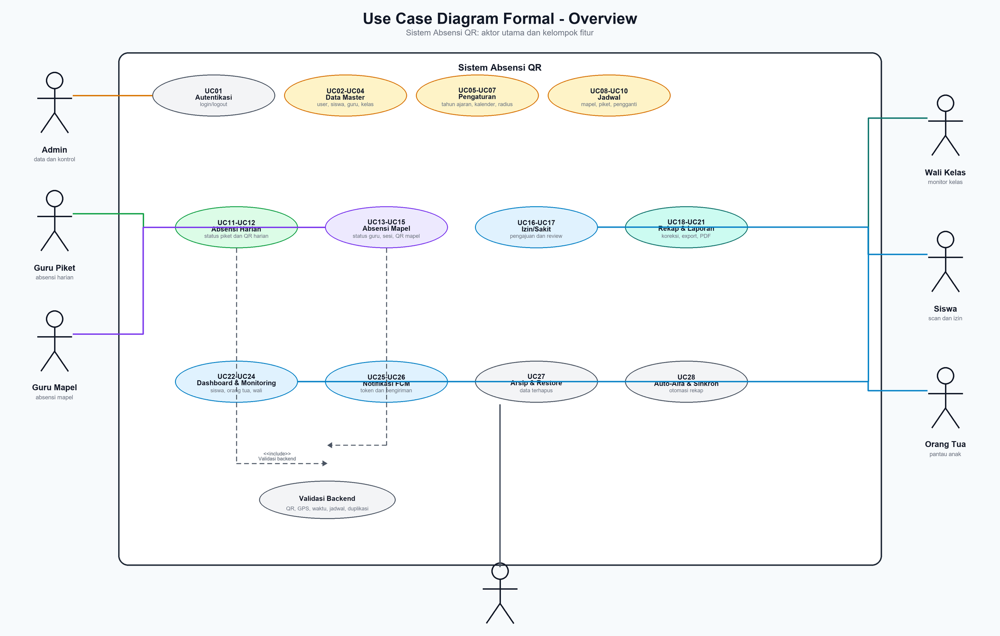
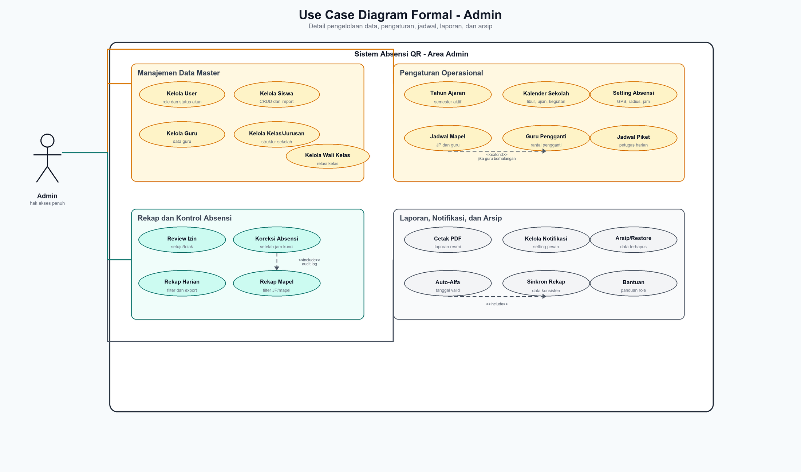
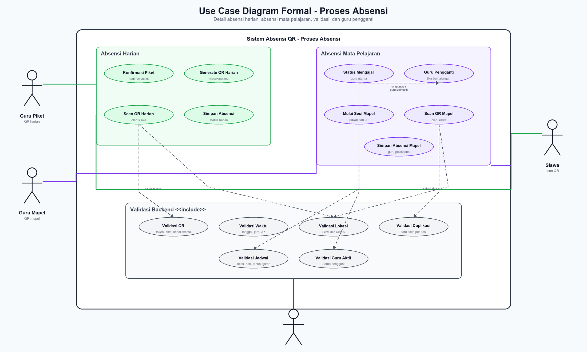
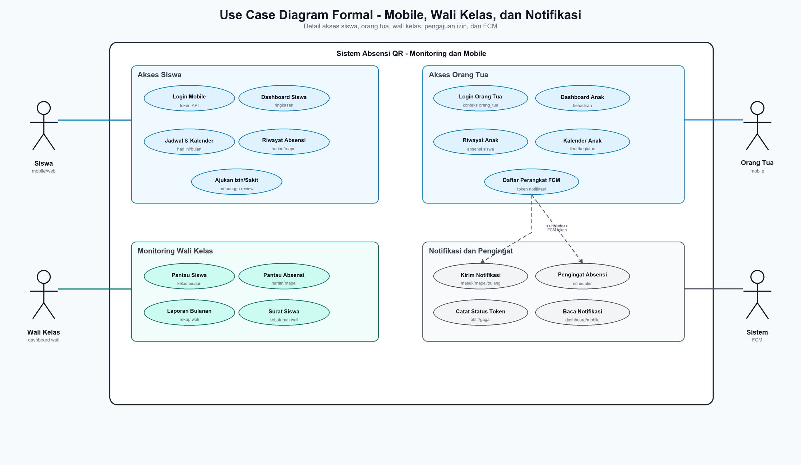

# Use Case Formal Sistem Absensi QR

## 1. Identifikasi Sistem

Nama sistem: **Sistem Absensi QR**

Sistem Absensi QR adalah sistem informasi absensi sekolah berbasis website Laravel dan API mobile. Website digunakan oleh admin, guru piket, guru mata pelajaran, wali kelas, dan siswa jika diperlukan. Aplikasi mobile digunakan oleh siswa dan orang tua untuk melakukan scan QR, melihat dashboard, riwayat, kalender, serta menerima notifikasi.

Fokus utama sistem adalah mencatat dan memvalidasi absensi harian serta absensi mata pelajaran dengan aturan QR, lokasi GPS, radius sekolah, jadwal, Jam Pelajaran (JP), status guru aktif, tahun ajaran, semester, kalender sekolah, dan pencegahan duplikasi scan.

## 2. Ruang Lingkup Use Case

Ruang lingkup use case mencakup:

1. Autentikasi pengguna website dan mobile.
2. Pengelolaan data master sekolah.
3. Pengaturan tahun ajaran, semester, kalender sekolah, lokasi, radius, dan jam absensi.
4. Pengelolaan jadwal pelajaran, jadwal guru piket, dan guru pengganti.
5. Absensi harian dengan QR masuk dan pulang.
6. Absensi mata pelajaran dengan QR berdasarkan jadwal dan JP.
7. Pengajuan dan review izin/sakit siswa.
8. Koreksi, verifikasi, rekap, export, dan cetak PDF absensi.
9. Dashboard siswa, orang tua, guru, guru piket, wali kelas, dan admin.
10. Notifikasi FCM dan pengingat absensi.
11. Arsip, restore data, auto-alfa, dan sinkronisasi rekap.

## 3. Aktor Sistem

| Kode | Aktor | Deskripsi | Hak Akses Utama |
| --- | --- | --- | --- |
| A01 | Admin | Pengguna pengelola utama sistem. | Mengelola data master, jadwal, pengaturan, absensi, izin, rekap, laporan, notifikasi, arsip, dan proses otomatis. |
| A02 | Guru Piket | Guru yang bertugas menjaga absensi harian. | Konfirmasi status piket, membuat QR harian, memantau absensi, review izin, dan koreksi sebelum jam kunci. |
| A03 | Guru Mata Pelajaran | Guru utama atau guru pengganti pada jadwal pelajaran. | Konfirmasi status mengajar, memulai sesi mapel, membuat QR mapel, verifikasi absensi mapel, dan melihat rekap. |
| A04 | Wali Kelas | Guru yang membina satu kelas. | Memantau siswa kelasnya, melihat absensi, laporan bulanan, dan surat siswa. |
| A05 | Siswa | Pengguna mobile atau web terbatas. | Scan QR harian, scan QR mapel, melihat dashboard, jadwal, kalender, riwayat, dan mengajukan izin/sakit. |
| A06 | Orang Tua | Pengguna mobile yang terhubung ke akun siswa. | Melihat dashboard anak, riwayat absensi anak, kalender anak, dan menerima notifikasi. |
| A07 | Sistem | Proses otomatis backend. | Validasi QR, lokasi, jadwal, status aktif, duplikasi, notifikasi, auto-alfa, dan sinkronisasi rekap. |

## 4. Diagram Use Case Formal

### 4.1 Diagram Overview

Diagram overview menampilkan aktor utama dan kelompok fitur besar dalam sistem.

### 4.2 Diagram Detail Admin

Diagram detail admin menampilkan fitur pengelolaan data, pengaturan operasional, rekap, laporan, notifikasi, dan arsip.

### 4.3 Diagram Detail Proses Absensi

Diagram proses absensi menampilkan absensi harian, absensi mata pelajaran, guru pengganti, dan validasi backend.

### 4.4 Diagram Detail Mobile, Wali Kelas, dan Notifikasi

Diagram ini menampilkan akses siswa, orang tua, wali kelas, dan proses notifikasi FCM.

## 5. Daftar Use Case

| Kode | Nama Use Case | Aktor Utama | Aktor Pendukung | Prioritas |
| --- | --- | --- | --- | --- |
| UC01 | Login dan Logout | Semua pengguna | Sistem | Tinggi |
| UC02 | Kelola User dan Role | Admin | Sistem | Tinggi |
| UC03 | Kelola Data Siswa | Admin | Sistem | Tinggi |
| UC04 | Kelola Data Guru, Kelas, Jurusan, dan Wali Kelas | Admin | Sistem | Tinggi |
| UC05 | Kelola Tahun Ajaran dan Semester | Admin | Sistem | Tinggi |
| UC06 | Kelola Kalender Sekolah | Admin | Sistem | Sedang |
| UC07 | Kelola Pengaturan Absensi | Admin | Sistem | Tinggi |
| UC08 | Kelola Jadwal Pelajaran | Admin | Sistem | Tinggi |
| UC09 | Kelola Guru Pengganti Mata Pelajaran | Admin | Sistem | Tinggi |
| UC10 | Kelola Jadwal Guru Piket dan Pengganti | Admin | Sistem | Tinggi |
| UC11 | Konfirmasi Status Guru Piket | Guru Piket | Sistem | Tinggi |
| UC12 | Generate QR Absensi Harian | Guru Piket | Sistem | Tinggi |
| UC13 | Scan QR Absensi Harian | Siswa | Sistem | Tinggi |
| UC14 | Konfirmasi Status Mengajar | Guru Mata Pelajaran | Sistem | Tinggi |
| UC15 | Mulai Sesi dan Generate QR Mapel | Guru Mata Pelajaran | Sistem | Tinggi |
| UC16 | Scan QR Absensi Mapel | Siswa | Sistem | Tinggi |
| UC17 | Ajukan Izin/Sakit | Siswa | Sistem | Tinggi |
| UC18 | Review Pengajuan Izin/Sakit | Admin, Guru Piket, Guru Mata Pelajaran | Sistem | Tinggi |
| UC19 | Koreksi dan Verifikasi Absensi | Admin, Guru Piket, Guru Mata Pelajaran | Sistem | Tinggi |
| UC20 | Lihat Rekap Absensi Harian | Admin, Guru Piket, Wali Kelas | Sistem | Sedang |
| UC21 | Lihat Rekap Absensi Mapel | Admin, Guru Mata Pelajaran, Wali Kelas | Sistem | Sedang |
| UC22 | Export dan Cetak PDF Laporan | Admin, Guru, Guru Piket, Wali Kelas | Sistem | Sedang |
| UC23 | Lihat Dashboard Siswa | Siswa | Sistem | Tinggi |
| UC24 | Lihat Dashboard Orang Tua | Orang Tua | Sistem | Tinggi |
| UC25 | Monitoring Siswa oleh Wali Kelas | Wali Kelas | Sistem | Sedang |
| UC26 | Daftar Perangkat FCM | Siswa, Orang Tua | Sistem | Sedang |
| UC27 | Kelola Notifikasi | Admin | Sistem | Sedang |
| UC28 | Kelola Arsip dan Restore Data | Admin | Sistem | Sedang |
| UC29 | Auto-Alfa dan Sinkronisasi Rekap | Admin | Sistem | Tinggi |
| UC30 | Akses Bantuan Sistem | Admin, Guru, Guru Piket, Siswa | Sistem | Rendah |

## 6. Relasi Include dan Extend

| Use Case Sumber | Relasi | Use Case Tujuan | Keterangan |
| --- | --- | --- | --- |
| UC12 Generate QR Absensi Harian | include | UC11 Konfirmasi Status Guru Piket | QR harian hanya dapat dibuat oleh petugas piket aktif yang hadir. |
| UC13 Scan QR Absensi Harian | include | Validasi Backend | Scan wajib memvalidasi token QR, status aktif, tanggal, lokasi, radius, dan duplikasi. |
| UC15 Mulai Sesi dan Generate QR Mapel | include | UC14 Konfirmasi Status Mengajar | Sesi mapel hanya dapat dimulai oleh guru aktif. |
| UC16 Scan QR Absensi Mapel | include | Validasi Backend | Scan mapel wajib memvalidasi QR, kelas, jadwal, JP, lokasi, dan duplikasi. |
| UC14 Konfirmasi Status Mengajar | extend | UC09 Kelola Guru Pengganti Mata Pelajaran | Guru pengganti dipakai ketika guru utama izin atau sakit. |
| UC19 Koreksi dan Verifikasi Absensi | include | Audit Perubahan | Perubahan absensi dicatat agar dapat ditelusuri. |
| UC19 Koreksi dan Verifikasi Absensi | extend | Jam Kunci Absensi | Setelah jam kunci, koreksi non-admin ditolak. |
| UC20 Lihat Rekap Absensi Harian | include | Filter Data | Rekap dapat difilter berdasarkan tanggal, kelas, status, semester, dan tahun ajaran. |
| UC21 Lihat Rekap Absensi Mapel | include | Filter Data | Rekap dapat difilter berdasarkan tanggal, kelas, mapel, JP, status, dan tahun ajaran. |
| UC22 Export dan Cetak PDF Laporan | include | UC20 atau UC21 | Laporan dicetak berdasarkan data rekap yang dipilih. |
| UC27 Kelola Notifikasi | include | UC26 Daftar Perangkat FCM | Pengiriman notifikasi mobile membutuhkan token perangkat. |
| UC29 Auto-Alfa dan Sinkronisasi Rekap | include | Validasi Kalender dan Batas Waktu | Auto-alfa tidak boleh berjalan untuk tanggal masa depan atau sebelum batas absensi. |

## 7. Spesifikasi Use Case Detail

### UC01 - Login dan Logout

| Elemen | Keterangan |
| --- | --- |
| Aktor Utama | Admin, Guru Piket, Guru Mata Pelajaran, Wali Kelas, Siswa, Orang Tua |
| Tujuan | Pengguna masuk ke sistem sesuai hak akses dan keluar dari sesi/token. |
| Prasyarat | Pengguna memiliki akun aktif. |
| Pemicu | Pengguna membuka halaman login website atau login aplikasi mobile. |
| Alur Normal | 1. Pengguna mengisi username dan password. 2. Sistem memvalidasi kredensial. 3. Sistem memeriksa status akun dan role. 4. Website mengarahkan pengguna ke dashboard sesuai role. 5. Mobile menerima token API sesuai konteks siswa atau orang tua. 6. Pengguna dapat logout ketika selesai. |
| Alur Alternatif | Jika akun tidak aktif, password salah, atau role tidak sesuai, sistem menolak login dan menampilkan pesan kesalahan. |
| Postcondition | Pengguna berhasil masuk dan hanya dapat mengakses fitur sesuai role. |

### UC02 - Kelola User dan Role

| Elemen | Keterangan |
| --- | --- |
| Aktor Utama | Admin |
| Tujuan | Mengelola akun pengguna dan hak akses. |
| Prasyarat | Admin sudah login. |
| Alur Normal | 1. Admin membuka menu user. 2. Admin menambah, mengubah, menghapus, reset password, atau mengaktifkan/nonaktifkan akun. 3. Sistem memvalidasi data. 4. Sistem menyimpan perubahan. |
| Alur Alternatif | Jika data tidak valid atau akun masih terhubung ke data penting, sistem menolak atau membatasi perubahan. |
| Postcondition | Data user dan role tersimpan. |

### UC03 - Kelola Data Siswa

| Elemen | Keterangan |
| --- | --- |
| Aktor Utama | Admin |
| Tujuan | Mengelola data siswa sebagai dasar absensi. |
| Prasyarat | Data kelas dan jurusan tersedia. |
| Alur Normal | 1. Admin membuka menu siswa. 2. Admin menambah, mengubah, melihat detail, menghapus, atau mengimpor data siswa. 3. Sistem memvalidasi NIS, kelas, dan informasi orang tua. 4. Sistem menyimpan data siswa. |
| Alur Alternatif | Jika format import salah atau data wajib kosong, sistem menolak penyimpanan. |
| Postcondition | Data siswa dapat digunakan untuk absensi, dashboard mobile, rekap, dan laporan. |

### UC04 - Kelola Data Guru, Kelas, Jurusan, dan Wali Kelas

| Elemen | Keterangan |
| --- | --- |
| Aktor Utama | Admin |
| Tujuan | Menyiapkan struktur akademik sekolah. |
| Prasyarat | Admin sudah login. |
| Alur Normal | 1. Admin mengelola data guru. 2. Admin mengelola jurusan dan kelas. 3. Admin menetapkan wali kelas. 4. Sistem menyimpan relasi data. |
| Alur Alternatif | Jika data sedang dipakai oleh jadwal aktif, sistem dapat membatasi penghapusan. |
| Postcondition | Struktur sekolah tersedia untuk jadwal, absensi, dan laporan. |

### UC05 - Kelola Tahun Ajaran dan Semester

| Elemen | Keterangan |
| --- | --- |
| Aktor Utama | Admin |
| Tujuan | Menentukan periode akademik aktif. |
| Prasyarat | Admin sudah login. |
| Alur Normal | 1. Admin membuka menu tahun ajaran. 2. Admin membuat atau mengubah tahun ajaran. 3. Admin mengaktifkan tahun ajaran dan semester. 4. Sistem menggunakan periode aktif pada jadwal, absensi, dan rekap. |
| Alur Alternatif | Jika tidak ada tahun ajaran aktif, beberapa proses rekap dan validasi dapat tidak lengkap. |
| Postcondition | Tahun ajaran dan semester aktif tersimpan. |

### UC06 - Kelola Kalender Sekolah

| Elemen | Keterangan |
| --- | --- |
| Aktor Utama | Admin |
| Tujuan | Mengelola hari libur, ujian, dan kegiatan sekolah. |
| Prasyarat | Tahun ajaran aktif tersedia. |
| Alur Normal | 1. Admin membuka kalender sekolah. 2. Admin menambah, mengubah, menghapus, import, export, atau generate kalender nasional jika tersedia. 3. Sistem menyimpan kalender. 4. Mobile menampilkan kalender sesuai bulan yang dipilih. |
| Alur Alternatif | Jika tanggal termasuk hari libur, sistem dapat menolak absensi sesuai aturan. |
| Postcondition | Kalender sekolah menjadi acuan absensi dan informasi mobile. |

### UC07 - Kelola Pengaturan Absensi

| Elemen | Keterangan |
| --- | --- |
| Aktor Utama | Admin |
| Tujuan | Menentukan aturan operasional absensi. |
| Prasyarat | Admin sudah login. |
| Alur Normal | 1. Admin membuka menu pengaturan. 2. Admin mengatur latitude, longitude, radius, jam masuk, batas terlambat, jam pulang, jam kunci absensi, dan masa aktif QR. 3. Sistem menyimpan pengaturan. 4. Sistem memakai aturan tersebut saat scan dan koreksi absensi. |
| Alur Alternatif | Jika koordinat/radius tidak valid, sistem menolak pengaturan. |
| Postcondition | Aturan absensi aktif dan menjadi acuan validasi backend. |

### UC08 - Kelola Jadwal Pelajaran

| Elemen | Keterangan |
| --- | --- |
| Aktor Utama | Admin |
| Tujuan | Membuat jadwal pelajaran berdasarkan kelas, mapel, guru, hari, jam, dan JP. |
| Prasyarat | Data guru, kelas, jurusan, mapel, dan tahun ajaran tersedia. |
| Alur Normal | 1. Admin membuka menu jadwal. 2. Admin membuat, mengubah, menghapus, atau import jadwal. 3. Sistem memeriksa kelengkapan data dan potensi bentrok. 4. Sistem menyimpan jadwal. |
| Alur Alternatif | Jika jadwal bentrok, sistem menampilkan informasi bentrok agar admin memperbaiki data. |
| Postcondition | Jadwal tersedia untuk guru, siswa, absensi mapel, dan rekap. |

### UC09 - Kelola Guru Pengganti Mata Pelajaran

| Elemen | Keterangan |
| --- | --- |
| Aktor Utama | Admin |
| Tujuan | Menentukan guru pengganti ketika guru utama berhalangan. |
| Prasyarat | Jadwal pelajaran tersedia. |
| Alur Normal | 1. Admin membuka detail jadwal. 2. Admin memilih guru pengganti. 3. Sistem menyimpan relasi guru pengganti. 4. Ketika guru utama izin/sakit, sistem menggunakan guru pengganti aktif. |
| Alur Alternatif | Jika pengganti pertama berhalangan, admin dapat menetapkan pengganti lanjutan sesuai aturan sistem. |
| Postcondition | Guru aktif untuk sesi mapel dapat ditentukan secara konsisten. |

### UC10 - Kelola Jadwal Guru Piket dan Pengganti

| Elemen | Keterangan |
| --- | --- |
| Aktor Utama | Admin |
| Tujuan | Menentukan guru piket harian dan pengganti jika petugas berhalangan. |
| Prasyarat | Data guru tersedia. |
| Alur Normal | 1. Admin membuka menu guru piket. 2. Admin membuat jadwal piket. 3. Admin menentukan pengganti bila diperlukan. 4. Sistem menyimpan jadwal dan rantai pengganti. |
| Alur Alternatif | Jika petugas aktif digantikan, QR lama tidak dapat dipakai lagi. |
| Postcondition | Petugas piket aktif dapat membuat QR harian sesuai tanggal tugas. |

### UC11 - Konfirmasi Status Guru Piket

| Elemen | Keterangan |
| --- | --- |
| Aktor Utama | Guru Piket |
| Tujuan | Menentukan status petugas piket pada tanggal berjalan. |
| Prasyarat | Guru piket sudah login dan memiliki jadwal piket. |
| Alur Normal | 1. Guru piket membuka dashboard piket. 2. Guru memilih status hadir, izin, atau sakit. 3. Sistem menyimpan status per tanggal. 4. Jika hadir dan aktif, guru piket dapat membuat QR. |
| Alur Alternatif | Jika guru tidak bertugas atau sudah digantikan, sistem menolak akses generate QR. |
| Postcondition | Status piket harian tersimpan. |

### UC12 - Generate QR Absensi Harian

| Elemen | Keterangan |
| --- | --- |
| Aktor Utama | Guru Piket |
| Tujuan | Membuat QR masuk atau pulang untuk absensi harian siswa. |
| Prasyarat | Guru piket aktif berstatus hadir. |
| Alur Normal | 1. Guru piket membuka menu QR harian. 2. Guru memilih jenis QR masuk atau pulang. 3. Sistem membuat token QR dengan tanggal, petugas aktif, masa berlaku, dan status aktif. 4. QR ditampilkan untuk discan siswa. |
| Alur Alternatif | Jika QR sebelumnya tidak lagi sesuai petugas aktif atau kedaluwarsa, sistem membuat QR baru dan QR lama tidak dapat dipakai. |
| Postcondition | QR absensi harian aktif tersedia. |

### UC13 - Scan QR Absensi Harian

| Elemen | Keterangan |
| --- | --- |
| Aktor Utama | Siswa |
| Aktor Pendukung | Sistem |
| Tujuan | Mencatat absensi masuk atau pulang siswa. |
| Prasyarat | Siswa sudah login mobile, QR aktif tersedia, dan GPS aktif. |
| Alur Normal | 1. Siswa membuka fitur scan. 2. Siswa scan QR harian. 3. Mobile mengirim token QR dan koordinat GPS. 4. Sistem memvalidasi token, akun siswa, tanggal, masa aktif QR, lokasi, radius, kalender, dan duplikasi scan. 5. Sistem menyimpan absensi harian. 6. Dashboard dan riwayat diperbarui. |
| Alur Alternatif | Jika QR tidak valid, lokasi di luar radius, hari libur, akun tidak aktif, atau sudah scan, sistem menolak absensi. |
| Postcondition | Absensi harian siswa tercatat. |

### UC14 - Konfirmasi Status Mengajar

| Elemen | Keterangan |
| --- | --- |
| Aktor Utama | Guru Mata Pelajaran |
| Tujuan | Menentukan status guru pada jadwal pelajaran hari ini. |
| Prasyarat | Guru memiliki jadwal atau menjadi pengganti aktif. |
| Alur Normal | 1. Guru membuka jadwal mengajar. 2. Guru utama memilih status hadir, izin, atau sakit. 3. Sistem menyimpan status per tanggal. 4. Jika guru utama hadir, guru utama menjadi guru aktif. |
| Alur Alternatif | Jika guru utama izin/sakit, sistem menggunakan guru pengganti aktif. |
| Postcondition | Guru aktif sesi mapel dapat ditentukan. |

### UC15 - Mulai Sesi dan Generate QR Mapel

| Elemen | Keterangan |
| --- | --- |
| Aktor Utama | Guru Mata Pelajaran |
| Tujuan | Membuka sesi absensi mata pelajaran dan menampilkan QR mapel. |
| Prasyarat | Guru aktif sudah terkonfirmasi, jadwal mapel tersedia, dan waktu sesi valid. |
| Alur Normal | 1. Guru aktif membuka jadwal. 2. Guru memilih mulai sesi. 3. Sistem memvalidasi jadwal, guru aktif, tanggal, hari, dan JP. 4. Sistem membuat QR mapel. 5. QR mapel ditampilkan untuk kelas terkait. |
| Alur Alternatif | Jika guru bukan pelaksana aktif atau jadwal tidak sesuai, sistem menolak sesi. |
| Postcondition | QR mapel aktif tersedia. |

### UC16 - Scan QR Absensi Mapel

| Elemen | Keterangan |
| --- | --- |
| Aktor Utama | Siswa |
| Aktor Pendukung | Sistem |
| Tujuan | Mencatat kehadiran siswa pada mata pelajaran tertentu. |
| Prasyarat | Siswa login mobile, QR mapel aktif, GPS aktif, dan siswa berada pada kelas yang sesuai. |
| Alur Normal | 1. Siswa scan QR mapel. 2. Mobile mengirim token QR dan koordinat GPS. 3. Sistem memvalidasi QR, kelas siswa, jadwal, hari, tahun ajaran, sesi JP, guru aktif, lokasi, radius, dan duplikasi. 4. Sistem menyimpan absensi mapel beserta guru pelaksana. |
| Alur Alternatif | Jika QR bukan untuk kelas siswa, sesi tidak aktif, lokasi tidak valid, atau sudah scan, sistem menolak absensi. |
| Postcondition | Absensi mapel siswa tercatat dan dapat direkap. |

### UC17 - Ajukan Izin/Sakit

| Elemen | Keterangan |
| --- | --- |
| Aktor Utama | Siswa |
| Tujuan | Mengajukan izin atau sakit kepada pihak sekolah. |
| Prasyarat | Siswa sudah login. |
| Alur Normal | 1. Siswa membuka menu pengajuan izin/sakit. 2. Siswa mengisi tanggal, jenis, dan keterangan. 3. Sistem memvalidasi data. 4. Sistem menyimpan pengajuan dengan status menunggu review. |
| Alur Alternatif | Jika data tidak lengkap atau tanggal tidak valid, sistem menolak pengajuan. |
| Postcondition | Pengajuan izin/sakit tercatat. |

### UC18 - Review Pengajuan Izin/Sakit

| Elemen | Keterangan |
| --- | --- |
| Aktor Utama | Admin, Guru Piket, Guru Mata Pelajaran |
| Tujuan | Meninjau pengajuan izin/sakit siswa. |
| Prasyarat | Pengajuan izin/sakit sudah dibuat. |
| Alur Normal | 1. Aktor membuka daftar pengajuan. 2. Aktor melihat detail pengajuan. 3. Aktor menyetujui atau menolak. 4. Sistem memperbarui status pengajuan. |
| Alur Alternatif | Jika aktor tidak memiliki hak akses, sistem menolak review. |
| Postcondition | Status pengajuan izin/sakit diperbarui. |

### UC19 - Koreksi dan Verifikasi Absensi

| Elemen | Keterangan |
| --- | --- |
| Aktor Utama | Admin, Guru Piket, Guru Mata Pelajaran |
| Tujuan | Memperbaiki data absensi yang perlu diverifikasi. |
| Prasyarat | Data absensi tersedia. |
| Alur Normal | 1. Aktor membuka data absensi. 2. Aktor melihat detail siswa. 3. Aktor memperbarui status atau informasi absensi. 4. Sistem memvalidasi hak akses dan jam kunci. 5. Sistem menyimpan perubahan dan mencatat audit. |
| Alur Alternatif | Jika sudah melewati jam kunci, koreksi non-admin ditolak. |
| Postcondition | Data absensi terkoreksi dan tercatat. |

### UC20 - Lihat Rekap Absensi Harian

| Elemen | Keterangan |
| --- | --- |
| Aktor Utama | Admin, Guru Piket, Wali Kelas |
| Tujuan | Melihat rekap absensi masuk/pulang siswa. |
| Prasyarat | Data siswa dan absensi tersedia. |
| Alur Normal | 1. Aktor membuka halaman rekap harian. 2. Aktor memilih filter. 3. Sistem menampilkan data hadir, terlambat, izin, sakit, alfa, atau belum absen. |
| Alur Alternatif | Jika belum ada data scan, sistem tetap dapat menampilkan siswa sebagai belum absen/alfa sesuai aturan. |
| Postcondition | Rekap harian dapat dipantau atau dipakai untuk laporan. |

### UC21 - Lihat Rekap Absensi Mapel

| Elemen | Keterangan |
| --- | --- |
| Aktor Utama | Admin, Guru Mata Pelajaran, Wali Kelas |
| Tujuan | Melihat rekap absensi berdasarkan mata pelajaran dan JP. |
| Prasyarat | Jadwal mapel dan data siswa tersedia. |
| Alur Normal | 1. Aktor membuka rekap mapel. 2. Aktor memilih filter tanggal, kelas, mapel, JP, status, semester, dan tahun ajaran. 3. Sistem menampilkan siswa yang sudah dan belum scan. |
| Alur Alternatif | Jika guru pengganti bertugas, sistem menampilkan guru pelaksana aktif pada data absensi. |
| Postcondition | Rekap absensi mapel tersedia. |

### UC22 - Export dan Cetak PDF Laporan

| Elemen | Keterangan |
| --- | --- |
| Aktor Utama | Admin, Guru, Guru Piket, Wali Kelas |
| Tujuan | Menghasilkan laporan absensi dalam format export atau PDF. |
| Prasyarat | Data rekap tersedia. |
| Alur Normal | 1. Aktor membuka halaman laporan. 2. Aktor memilih filter. 3. Sistem menampilkan rekap. 4. Aktor menekan export atau PDF. 5. Sistem menghasilkan file laporan. |
| Alur Alternatif | Jika data kosong, sistem menghasilkan laporan kosong atau menampilkan pesan sesuai kondisi. |
| Postcondition | Laporan dapat digunakan untuk administrasi sekolah. |

### UC23 - Lihat Dashboard Siswa

| Elemen | Keterangan |
| --- | --- |
| Aktor Utama | Siswa |
| Tujuan | Melihat ringkasan kehadiran, jadwal, kalender, dan riwayat. |
| Prasyarat | Siswa sudah login mobile atau web. |
| Alur Normal | 1. Siswa membuka dashboard. 2. Sistem menampilkan data profil, jadwal hari ini, status absensi, riwayat, kalender, dan notifikasi. |
| Alur Alternatif | Jika data jadwal tidak tersedia, sistem menampilkan informasi kosong sesuai kondisi. |
| Postcondition | Siswa mengetahui status kehadiran dan jadwalnya. |

### UC24 - Lihat Dashboard Orang Tua

| Elemen | Keterangan |
| --- | --- |
| Aktor Utama | Orang Tua |
| Tujuan | Memantau kehadiran anak. |
| Prasyarat | Orang tua login menggunakan konteks orang tua yang terhubung dengan data siswa. |
| Alur Normal | 1. Orang tua membuka dashboard mobile. 2. Sistem menampilkan profil anak, kehadiran, riwayat, kalender, dan notifikasi. |
| Alur Alternatif | Jika nomor orang tua tidak cocok dengan data siswa, akses ditolak. |
| Postcondition | Orang tua dapat memantau kehadiran anak. |

### UC25 - Monitoring Siswa oleh Wali Kelas

| Elemen | Keterangan |
| --- | --- |
| Aktor Utama | Wali Kelas |
| Tujuan | Memantau siswa dalam kelas binaan. |
| Prasyarat | Guru sudah ditetapkan sebagai wali kelas. |
| Alur Normal | 1. Wali kelas membuka dashboard wali. 2. Sistem menampilkan siswa kelas binaan. 3. Wali kelas melihat detail siswa, absensi, laporan bulanan, dan surat siswa. |
| Alur Alternatif | Jika guru belum menjadi wali kelas, sistem tidak menampilkan data kelas binaan. |
| Postcondition | Wali kelas dapat memonitor siswa binaannya. |

### UC26 - Daftar Perangkat FCM

| Elemen | Keterangan |
| --- | --- |
| Aktor Utama | Siswa, Orang Tua |
| Tujuan | Mendaftarkan token perangkat agar notifikasi dapat diterima. |
| Prasyarat | Pengguna sudah login mobile dan perangkat memiliki token FCM. |
| Alur Normal | 1. Mobile mengirim token FCM, siswa_id, dan audience. 2. Sistem memvalidasi role konteks siswa/orang tua. 3. Sistem menyimpan atau memperbarui token perangkat. |
| Alur Alternatif | Jika role konteks tidak sesuai, sistem menolak pendaftaran token. |
| Postcondition | Perangkat siap menerima notifikasi. |

### UC27 - Kelola Notifikasi

| Elemen | Keterangan |
| --- | --- |
| Aktor Utama | Admin |
| Aktor Pendukung | Sistem |
| Tujuan | Mengatur dan mengirim notifikasi absensi. |
| Prasyarat | Token FCM tersedia dan konfigurasi notifikasi aktif. |
| Alur Normal | 1. Admin membuka pengaturan notifikasi. 2. Admin mengatur preferensi pesan. 3. Sistem mengirim notifikasi absensi masuk, mapel, pulang, dan pengingat. 4. Sistem mencatat status token jika tersedia. |
| Alur Alternatif | Jika token gagal, sistem dapat menandai token tidak aktif atau menyimpan pesan error. |
| Postcondition | Notifikasi terkirim ke pengguna terkait. |

### UC28 - Kelola Arsip dan Restore Data

| Elemen | Keterangan |
| --- | --- |
| Aktor Utama | Admin |
| Tujuan | Mengelola data yang dihapus secara arsip. |
| Prasyarat | Data mendukung arsip/soft delete. |
| Alur Normal | 1. Admin membuka halaman arsip. 2. Admin memilih resource. 3. Admin restore, hapus permanen, atau kosongkan arsip. 4. Sistem memvalidasi konflik data aktif. |
| Alur Alternatif | Jika restore menyebabkan konflik dengan data aktif, sistem menolak restore. |
| Postcondition | Data arsip terkelola. |

### UC29 - Auto-Alfa dan Sinkronisasi Rekap

| Elemen | Keterangan |
| --- | --- |
| Aktor Utama | Admin |
| Aktor Pendukung | Sistem |
| Tujuan | Melengkapi data absensi siswa yang belum scan dan menyelaraskan rekap. |
| Prasyarat | Data siswa, jadwal, kalender, dan pengaturan batas waktu tersedia. |
| Alur Normal | 1. Admin menjalankan auto-alfa atau sinkronisasi. 2. Sistem memeriksa tanggal, kalender, dan batas waktu. 3. Sistem menandai siswa yang belum absen sebagai alfa sesuai aturan. 4. Sistem menyinkronkan data rekap. |
| Alur Alternatif | Jika tanggal masa depan atau belum melewati batas, sistem menolak proses. |
| Postcondition | Data rekap menjadi lebih lengkap dan konsisten. |

### UC30 - Akses Bantuan Sistem

| Elemen | Keterangan |
| --- | --- |
| Aktor Utama | Admin, Guru, Guru Piket, Siswa |
| Tujuan | Membaca panduan penggunaan sistem sesuai role. |
| Prasyarat | Pengguna membuka halaman bantuan. |
| Alur Normal | 1. Pengguna membuka menu bantuan. 2. Sistem menampilkan panduan publik atau panduan dashboard sesuai akses. |
| Alur Alternatif | Jika pengguna belum login, sistem hanya menampilkan bantuan publik. |
| Postcondition | Pengguna memperoleh informasi penggunaan sistem. |

## 8. Matriks Aktor dan Use Case

| Aktor | Use Case Terkait |
| --- | --- |
| Admin | UC01, UC02, UC03, UC04, UC05, UC06, UC07, UC08, UC09, UC10, UC18, UC19, UC20, UC21, UC22, UC27, UC28, UC29, UC30 |
| Guru Piket | UC01, UC11, UC12, UC18, UC19, UC20, UC22, UC30 |
| Guru Mata Pelajaran | UC01, UC14, UC15, UC18, UC19, UC21, UC22, UC30 |
| Wali Kelas | UC01, UC20, UC21, UC22, UC25 |
| Siswa | UC01, UC13, UC16, UC17, UC23, UC26, UC30 |
| Orang Tua | UC01, UC24, UC26 |
| Sistem | UC01, UC13, UC16, UC26, UC27, UC29 |

## 9. Aturan Bisnis Penting

1. Validasi absensi wajib dilakukan di backend.
2. QR absensi memiliki masa aktif dan status aktif.
3. QR harian hanya boleh dibuat oleh guru piket aktif yang hadir.
4. QR mapel hanya boleh dibuat oleh guru aktif pada jadwal dan tanggal tersebut.
5. Guru aktif dapat berupa guru utama atau guru pengganti.
6. Status guru mengajar dan status guru piket disimpan per tanggal.
7. Scan QR wajib memvalidasi lokasi GPS dan radius sekolah.
8. Siswa tidak boleh melakukan scan ganda pada sesi yang sama.
9. Hari libur, ujian, dan kegiatan sekolah harus dipertimbangkan oleh sistem.
10. Setelah jam kunci, koreksi absensi oleh non-admin ditolak.
11. Orang tua mengakses data anak melalui konteks login orang tua yang terhubung ke data siswa.
12. Token FCM diperlukan agar siswa dan orang tua menerima notifikasi mobile.
13. Auto-alfa tidak boleh dijalankan untuk tanggal masa depan atau sebelum batas waktu absensi.

## 10. Kesimpulan Use Case

Use case ini sudah mencakup fitur utama sistem yang dibangun, yaitu pengelolaan data sekolah, pengaturan absensi, QR harian, QR mata pelajaran, guru pengganti, validasi backend, izin/sakit, rekap, laporan, notifikasi, arsip, dan akses mobile siswa/orang tua. Diagram dibuat terpisah agar formal, mudah dibaca, dan sesuai untuk kebutuhan dokumentasi skripsi.
